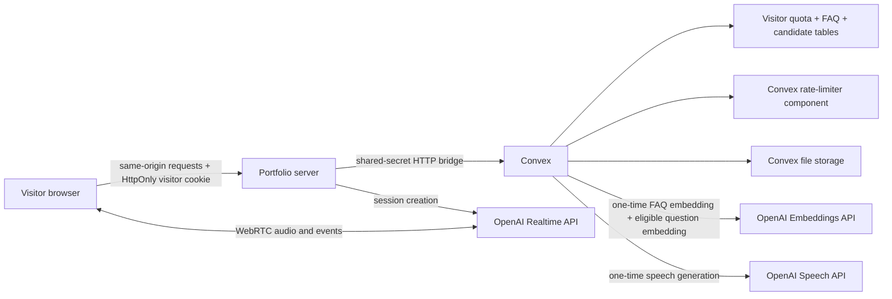
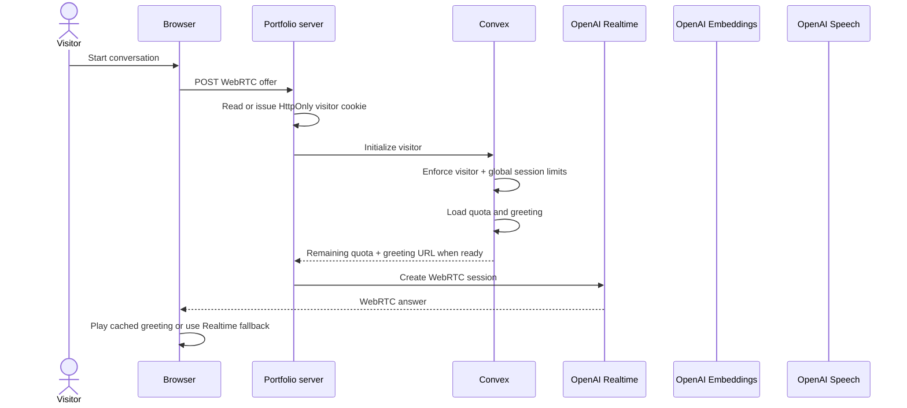
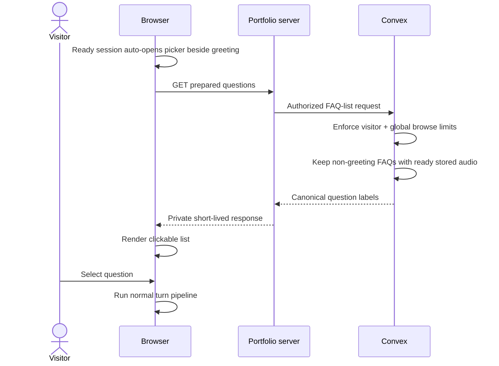

# Voice assistant quota and FAQ cache

## Decision

Keep browser-to-OpenAI WebRTC for low-latency speech. Put durable identity,
weekly quota, distributed abuse limits, FAQ routing, candidate logging, and generated audio in Convex.
Portfolio server remains only browser-facing trust boundary.

Production catalog contains one session greeting and 50 prepared questions covering
profile, skills, projects, leadership, location, availability, education, and
contact. Canonical inventory: [prepared-questions.md](prepared-questions.md).

Each question follows one route: normalized exact alias, semantic FAQ intent,
then Realtime fallback. Semantic matching uses one stored embedding per FAQ,
question embedding, cosine similarity, intent signals, confidence threshold, and
runner-up margin. Fifty bounded entries do not justify vector-index complexity. Cache
misses remain logged as candidates without automatic promotion.

## Components



- Portfolio server owns anonymous visitor cookie and never exposes Convex bridge
  secret or OpenAI API key.
- Convex HTTP actions accept only matching bearer secret.
- Convex checks per-visitor and global limits before session creation, every turn,
  prepared-question listing, or candidate write. Prepared answers avoid AI quota,
  but never bypass anti-spam limits.
- Convex action checks exact aliases, then semantic intent, before atomically
  spending quota.
- Narrow intent signals prevent unrelated questions from reaching semantically
  similar FAQs; confidence and runner-up margin reject ambiguous matches.
- Convex action generates MP3 once and stores resulting blob.
- Browser inserts cached assistant text into Realtime conversation before local
  audio playback, preserving follow-up context.
- Persistent chat-footer picker stays visible but fetches prepared questions only
  when visitor expands it. Convex returns only searchable FAQs with ready audio.

## Session sequence



## Turn sequence

```mermaid
sequenceDiagram
  actor Visitor
  participant Browser
  participant Portfolio as Portfolio server
  participant Convex
  participant Realtime as OpenAI Realtime

  Visitor->>Browser: Ask question
  Realtime-->>Browser: Incremental input transcript deltas
  Realtime-->>Browser: Completed input transcript
  Browser->>Browser: Finalize question + show thinking state
  Browser->>Portfolio: Route transcript
  Portfolio->>Convex: Route question
  Convex->>Convex: Enforce visitor + global turn limits
  alt Burst limit reached
    Convex-->>Browser: Retry delay; no FAQ read or AI call
  end
  Convex->>Convex: Check normalized exact aliases
  alt Exact alias
    Convex-->>Browser: Cached answer + audio + exact match
  else No exact alias
    Convex->>Convex: Require Anthony referent + FAQ intent signal
    Convex->>Embeddings: Embed eligible question
    Embeddings-->>Convex: Question vector
    Convex->>Convex: Cosine rank + threshold + runner-up margin
  end
  alt Cached FAQ with audio
    Convex-->>Browser: Answer text + stored audio URL
    Browser->>Realtime: Insert assistant text into conversation
    Browser->>Browser: Play stored audio
  else Cache miss and quota available
    Convex-->>Browser: Realtime allowed + updated remaining quota
    Browser->>Realtime: response.create
    Realtime-->>Browser: Spoken answer + transcript
    Browser->>Portfolio: Log question/answer candidate
    Portfolio->>Convex: Upsert candidate occurrence
  else Quota exhausted
    Convex-->>Browser: No generation allowed
    Browser->>Browser: Show local limit message; prepared picker remains usable
  end
```

## Prepared-question discovery



Question labels are curated catalog data provisioned explicitly during deployment. Ready
session auto-opens and fetches picker once; first user turn collapses it, with manual
reopening always available. One page-lifetime promise caches and deduplicates the list;
failed requests remain retryable. HTTP response may also be privately cached for five
minutes. UI accepts arbitrary catalog size;
expanded panel is height-capped and independently scrollable so 50+ entries
preserve visible transcript space.

## Quota

- Ten uncached Realtime answers per anonymous visitor window.
- Window lasts seven days from first uncached answer.
- Greeting and cached FAQ hits do not spend answer quota. Semantic matching has a
  small embedding cost but does not consume live-answer quota. Once quota reaches
  zero, unknown questions skip embedding and fail closed; exact prepared questions
  remain available.
- Convex mutation makes check and increment atomic across tabs/deployments.
- Production fails closed when Convex is unavailable; development keeps a
  local ten-answer fallback so UI and OpenAI fallbacks remain testable.
- Existing short-window IP/session limiter remains defense in depth.

Weekly quota controls paid answers. Separate distributed limits control request volume,
including prepared paths:

- Turns: visitor burst 2, refilling 12/minute; global burst 60, refilling 300/minute.
- Session starts: 4/10 minutes per visitor; global burst 10, refilling 30/minute.
- Prepared-list reads: visitor burst 2, refilling 6/minute; global burst 30,
  refilling 120/minute. Page cache normally makes this one request per visit.
- Candidate writes: visitor burst 3, refilling 10/hour; global burst 30,
  refilling 300/hour.

Global counters are sharded where traffic warrants it. Production deployment also has
daily and monthly warning plus hard-disable thresholds for function calls, database I/O,
egress, and action compute. These caps are final spend containment, not user-facing flow
control.

Visitor identity is opaque random value in production `Secure`, `HttpOnly`,
`SameSite=Lax`, host-only cookie. User can delete browser data and receive a new
identity; anonymous browser identity cannot prevent that. Visitor/global Convex limits
and existing IP burst limiting reduce trivial repeated resets.

## Cache lifecycle

Catalog provisioning is explicit, idempotent, versioned, and outside visitor session
startup. It creates or reconciles 51 records and schedules missing audio plus
intent-embedding generation with a short stagger. `pending`, `ready`, and `failed`
states prevent duplicate work. Answer changes regenerate audio; intent or embedding
version changes regenerate embeddings. Routine initialization performs no catalog scan.

Audio files are immutable Convex storage objects. FAQ rows keep storage ID;
request-time lookup resolves current URL. Replacements remove superseded stored audio.
Catalog answers remain code-owned and deployment reconciliation is required after edits.

Cache-miss candidates are stored but never auto-promoted. Review occurrence data,
then add deliberate aliases, intent signals, and verified answer/audio entries.
This avoids poisoning cache with visitor-generated content.

## Environment

Portfolio runtime:

```dotenv
OPENAI_API_KEY=...
CONVEX_SITE_URL=https://fabulous-warbler-191.convex.site
CONVEX_BRIDGE_SECRET=<same-random-secret-as-convex>
```

Convex production deployment:

```dotenv
OPENAI_API_KEY=...
BRIDGE_SECRET=<same-random-secret-as-portfolio>
```

`CONVEX_DEPLOYMENT` and `CONVEX_URL` are CLI-generated configuration. Browser
does not need `VITE_CONVEX_URL` because it never calls Convex directly.

## Known boundary

Direct WebRTC data channel still technically lets a determined visitor send
`response.create` without portfolio turn endpoint. This version prevents normal
UI abuse and keeps secrets server-side, but is not cryptographically strict
per-turn enforcement. Strict enforcement requires OpenAI sideband control with
browser response control removed, or a server-owned Realtime connection.

Returned Convex storage URLs can also be replayed until they expire. Global request limits
protect URL issuance and deployment egress hard limits cap total damage, but strict
per-play authorization would require proxying audio through a controlled edge/server path.

## Implemented path

1. Exact normalized aliases return immediately.
2. Remaining portfolio questions pass intent-signal eligibility.
3. `text-embedding-3-small` embeds eligible questions at 512 dimensions; direct
   cosine comparison ranks only signal-eligible stored vectors.
4. Confident semantic matches reuse verified text and MP3 without spending quota.
5. Ambiguous or unmatched questions atomically reserve quota and use Realtime.
6. Development marks semantic hits beside Prepared; production shows only Prepared.
7. Persistent lazy picker gives visitors direct access to all 50 ready cached answers,
   including after live-answer quota is exhausted.
