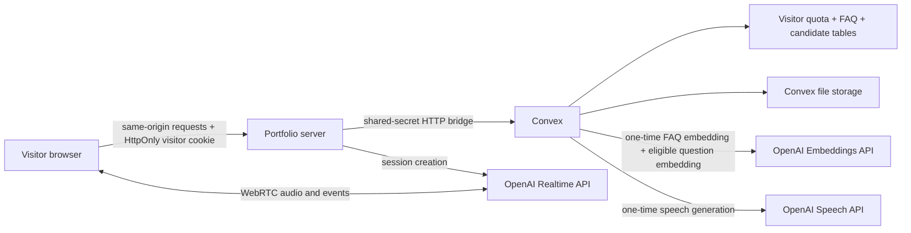
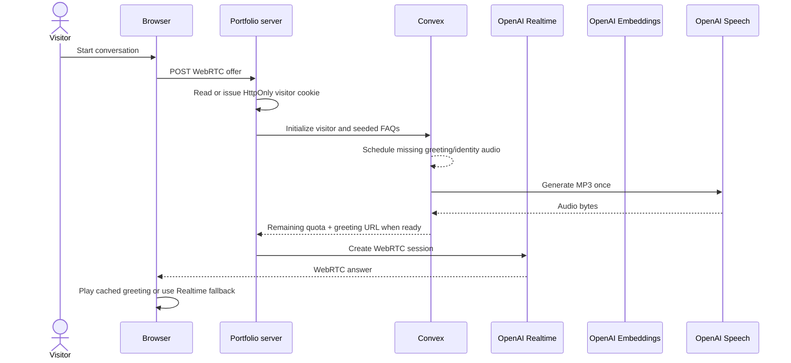
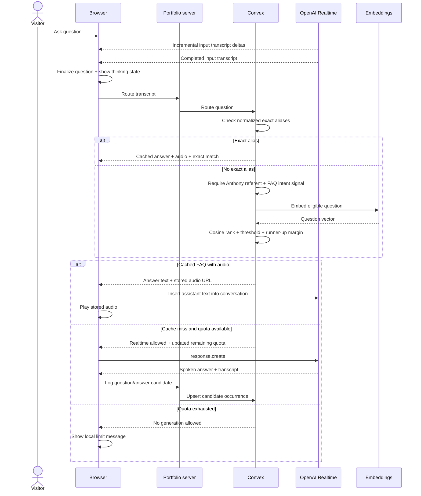

# Voice assistant quota and FAQ cache

## Decision

Keep browser-to-OpenAI WebRTC for low-latency speech. Put durable identity,
weekly quota, FAQ routing, candidate logging, and generated audio in Convex.
Portfolio server remains only browser-facing trust boundary.

Version one deliberately supports seven cached entries:

1. Session greeting.
2. “Who are you?” and normalized aliases.
3. Profile overview.
4. Next.js experience.
5. Latest projects.
6. Location.
7. Working style.

Each question follows one route: normalized exact alias, semantic FAQ intent,
then Realtime fallback. Semantic matching uses one stored embedding per FAQ,
question embedding, cosine similarity, intent signals, confidence threshold, and
runner-up margin. Seven entries do not justify vector-index complexity. Cache
misses remain logged as candidates without automatic promotion.

## Components



- Portfolio server owns anonymous visitor cookie and never exposes Convex bridge
  secret or OpenAI API key.
- Convex HTTP actions accept only matching bearer secret.
- Convex action checks exact aliases, then semantic intent, before atomically
  spending quota.
- Narrow intent signals prevent unrelated questions from reaching semantically
  similar FAQs; confidence and runner-up margin reject ambiguous matches.
- Convex action generates MP3 once and stores resulting blob.
- Browser inserts cached assistant text into Realtime conversation before local
  audio playback, preserving follow-up context.

## Session sequence



## Turn sequence



## Quota

- Ten uncached Realtime answers per anonymous visitor window.
- Window lasts seven days from first uncached answer.
- Greeting and cached FAQ hits do not spend answer quota. Semantic matching has a
  small embedding cost but does not consume live-answer quota.
- Convex mutation makes check and increment atomic across tabs/deployments.
- Production fails closed when Convex is unavailable; development keeps a
  local ten-answer fallback so UI and OpenAI fallbacks remain testable.
- Existing short-window IP/session limiter remains defense in depth.

Visitor identity is opaque random value in production `Secure`, `HttpOnly`,
`SameSite=Lax`, host-only cookie. User can delete browser data and receive a new
identity; anonymous browser identity cannot prevent that. Existing IP burst
limit reduces trivial repeated resets.

## Cache lifecycle

Seed data is idempotent. First successful Convex initialization creates missing
FAQ rows and schedules audio plus intent-embedding generation. `pending`, `ready`,
and `failed` state prevents duplicate generation and permits retry after failure.
Changing curated intent text invalidates and regenerates its embedding.
Curated aliases and intent signals reconcile on initialization, so pronoun and
nickname coverage updates without replacing stored audio.

Audio files are immutable Convex storage objects. FAQ rows keep storage ID;
request-time lookup resolves current URL. Version-one seed answers are code-owned;
changing one requires replacing corresponding FAQ row or adding seed-reconciliation
logic before deployment.

Cache-miss candidates are stored but never auto-promoted. Review occurrence data,
then add deliberate aliases, intent signals, and verified answer/audio entries.
This avoids poisoning cache with visitor-generated content.

## Environment

Portfolio runtime:

```dotenv
OPENAI_API_KEY=...
CONVEX_SITE_URL=https://fabulous-warbler-191.convex.site
CONVEX_BRIDGE_SECRET=<same-random-secret-as-convex>
```

Convex production deployment:

```dotenv
OPENAI_API_KEY=...
BRIDGE_SECRET=<same-random-secret-as-portfolio>
```

`CONVEX_DEPLOYMENT` and `CONVEX_URL` are CLI-generated configuration. Browser
does not need `VITE_CONVEX_URL` because it never calls Convex directly.

## Known boundary

Direct WebRTC data channel still technically lets a determined visitor send
`response.create` without portfolio turn endpoint. This version prevents normal
UI abuse and keeps secrets server-side, but is not cryptographically strict
per-turn enforcement. Strict enforcement requires OpenAI sideband control with
browser response control removed, or a server-owned Realtime connection.

## Implemented path

1. Exact normalized aliases return immediately.
2. Remaining portfolio questions pass intent-signal eligibility.
3. `text-embedding-3-small` embeds question; direct cosine comparison ranks six
   stored intent vectors.
4. Confident semantic matches reuse verified text and MP3 without spending quota.
5. Ambiguous or unmatched questions atomically reserve quota and use Realtime.
6. Development marks semantic hits beside Free; production shows only Free.
