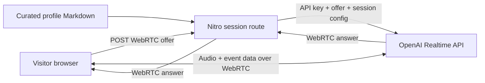
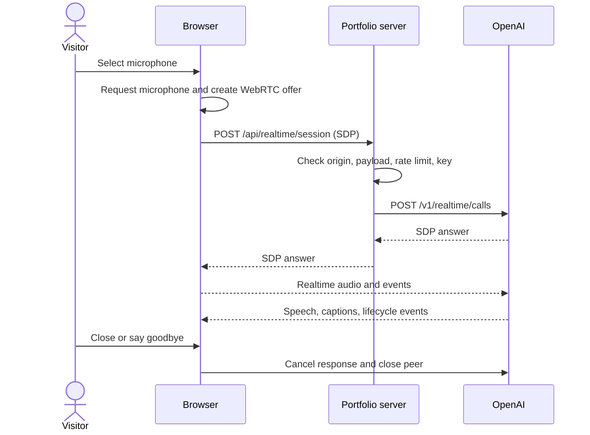

# Anthony AI assistant

## Outcome

Landing-page voice assistant answers questions about Anthony from a curated Markdown profile. Browser uses OpenAI Realtime API over WebRTC. Portfolio server performs only protected session creation; API key never enters client code.

## Setup

Create `.env.local` at repository root:

```dotenv
OPENAI_API_KEY=sk-proj-your-key
```

Restart development server after adding key. Do not prefix this variable with `VITE_`: Vite-prefixed values become browser-readable.

## Architecture



Server route exists because long-lived OpenAI API keys must not ship inside static JavaScript. Convex would add another service without removing this requirement, so current Nitro runtime handles session creation.

## Request sequence



## Main parts

- `src/components/voice-assistant.tsx`: WebRTC lifecycle, microphone/text modes, captions, timeout, stop/retry UI.
- `src/app/api.realtime.session.ts`: thin TanStack Start server route.
- `src/server/realtime-session.server.ts`: prompt, Realtime session configuration, validation, OpenAI handshake.
- `src/content/anthony-profile.md`: public, curated knowledge source. Update this file when Anthony's experience changes.
- `src/lib/realtime.ts`: event parsing and playback-echo detection.
- `src/lib/realtime-rate-limit.ts`: lightweight abuse guard.
- `tests/realtime.test.js`: deterministic fallback/event/session tests.

`src/content/anthony-profile.md` is separate from the original CV. It contains
repo-verified Bragi Notes, Tingshuo, Loany, Biotech, and portfolio work while
omitting private phone and company contact data.

The complete profile is embedded in each new session's instructions. No vector
database, retrieval layer, Convex storage, or cross-session memory is involved.
Keep this public knowledge source accurate and concise to control prompt cost.

## Conversation behavior

- Every session opens with: “Hello, I'm Anthony's AI assistant, what can I do for you ?”
- Unrelated requests receive one fixed sentence: “I'm only meant to answer questions about Anthony's experience and portfolio.” Related but unverified questions still direct visitors to Anthony.
- Low-eagerness semantic VAD identifies complete visitor turns. Client never cancels on raw sound detection: it waits for completed transcription, rejects likely playback echo, then interrupts only for verified visitor speech.
- Transcript smoothly follows new and streaming messages.
- `gpt-realtime-2.1-mini` keeps voice cost below larger Realtime models.
- Local development shows a two-model picker: mini (`Great`, `$`) and full
  `gpt-realtime-2.1` (`Best`, `$$$`). Production ignores model query parameters
  and always uses mini.
- Replies cap at 800 output tokens, while the prompt targets one or two sentences
  and fewer than 45 spoken words. Overview answers name at most three items,
  briefly describe them, then invite a focused follow-up. The higher hard cap
  remains because Realtime output budgets include audio and smaller caps can cut
  speech mid-sentence.
- Browser keeps assistant in speaking state until `output_audio_buffer.stopped`; `response.done` only means generation finished and can arrive before WebRTC playback drains.
- Session ends after five minutes; inactivity ends after 90 seconds.
- Saying goodbye invokes `end_conversation`; close button always works.
- Ending closes WebRTC peer, data channel, microphone tracks, pending handshake,
  and audio playback. Every new microphone click starts with empty context.
- Denied/unavailable microphone switches to typed input while keeping spoken output.
- Missing API key, invalid SDP, rate limit, network failure, and OpenAI failure return safe messages without leaking upstream details.

## Security and cost controls

- API key exists only in `OPENAI_API_KEY` on server.
- Same-origin request check and restrictive microphone permissions policy.
- Production session creation limited to four attempts per ten minutes per
  process/IP-derived identifier. Development bypasses this limit for model testing.
- SDP payload limited to 24 KB.
- OpenAI request timeout: 15 seconds.
- Session prompt treats profile as sole factual source and rejects instruction overrides.
- OpenAI safety identifier uses a one-way hash; raw IP is not sent.

In-memory limiting is intentionally deployment-local. Add durable rate limiting only if public abuse proves it necessary. For stronger budget protection, also set project-level OpenAI usage limits.

## Verification

```bash
bun run verify
```

Without a key, automated checks cover parsing, rate limiting, type safety,
formatting, build, and missing-key UI/API behavior. Live speech quality and
OpenAI session-schema acceptance require configured key.

## Official references

- [Realtime API with WebRTC](https://developers.openai.com/api/docs/guides/realtime-webrtc)
- [Realtime conversations](https://developers.openai.com/api/docs/guides/realtime-conversations)
- [Voice activity detection](https://developers.openai.com/api/docs/guides/realtime-vad)
- [`gpt-realtime-2.1-mini`](https://developers.openai.com/api/docs/models/gpt-realtime-2.1-mini)
